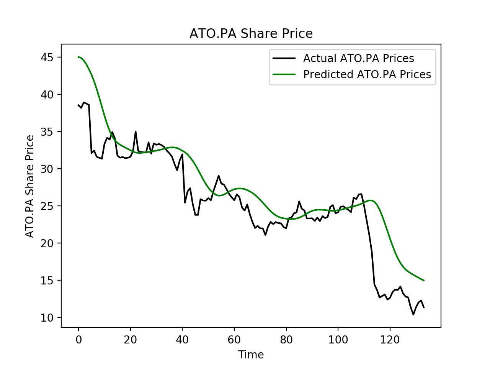
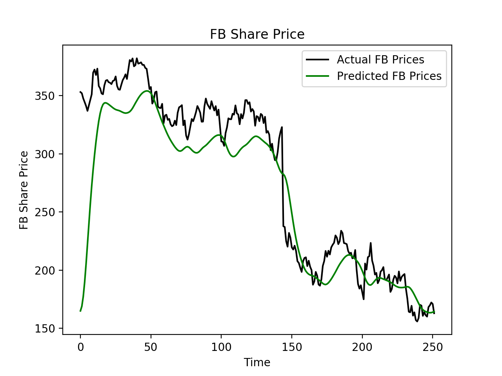

# Stock prices prediction

Data source is yahoo finance.

## Create environment

```console
conda env create -f env.yml
```
Run script in Terminal Session

```console
python main.py
```

### output ###

> For the next day, stock on the stock market: **14.827244 €**
---

> For the next day, stock on the stock market: **164.9372 $**